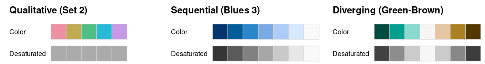

# Principios de Visualización de Datos

* Escribo este capítulo para difundir lo importante que es generar una buena visualización de datos. Con el paso del tiempo, he visto muy malas prácticas y escribir esto es una de aportar con un pequeño grano de arena a crear visualización eficientes y fáciles de entender.
* Es una recopilación de varias fuentes, en conjunto a los conocimientos que tengo sobre este tema.
* Lo pasé muy bien escribiendo sobre este tema, ojalá puedas pasarlo de la misma forma. ¡Gracias por darte el tiempo de leer esto! Obtendrás conocimientos muy útiles sobre visualizaciones de datos.

## Carga cognitiva

* Es el esfuerzo que nos demanda procesar y retener determinada información.
* La percepción visual ayuda a reducir la carga cognitiva, ayudando a entender las cosas de mejor forma, más fácil y dando la posibilidad de retener la información con el paso del tiempo.

Para ejemplificar la reducción de carga cognitiva, se mostrarán dos paneles de gráficos. ¿Cuál gráfico cumple de mejor forma su objetivo y reduce la carga cognitiva?

```{r echo=FALSE}
require(gghighlight)

datos <- rio::import('datos/datos.RDS')
datos %<>% as_tibble()

g_1 <- datos %>% 
  filter(continent == 'South America') %>% 
  group_by(location) %>% 
  summarise(new_vaccinations = sum(new_vaccinations, na.rm = TRUE)) %>% 
  arrange(-new_vaccinations) %>% 
  ggplot(aes(location, new_vaccinations, fill = location)) +
  geom_col() +
  scale_y_continuous(labels = scales::comma, 
                     expand = c(0, 0.01)) +
  labs(title = 'Progreso de vacunación en Chile',
       subtitle = 'Respecto al resto de Sudamérica',
       y = 'Total de Vacunas',
       x = 'País') +
  scale_fill_viridis_d() +
  coord_flip() +
  theme_minimal() +
  theme(legend.position = 'none',
        panel.grid.major.y = element_blank(),
        panel.grid.minor.y = element_blank(),
        axis.line = element_line(color = 'black'),
        axis.text.x = element_text(angle = 20, vjust = 0.6),
        axis.ticks.x.bottom = element_line(color = 'black'))

g_2 <- datos %>%
  filter(continent == 'South America') %>% 
  group_by(location) %>% 
  summarise(new_vaccinations = (sum(new_vaccinations, na.rm = TRUE) /     max(population) * 1e+6) %>% round(., 2)) %>% 
  arrange(-new_vaccinations) %>% 
  ggplot(aes(location, new_vaccinations, fill = location)) +
  geom_col() +
  scale_y_continuous(labels = scales::comma, 
                     expand = c(0, 0.01)) +
  labs(title = '',
       subtitle = '',
       y = 'Total de vacunas\npor millón de habitantes',
       x = '',
       caption = 'Figura 1') +
  scale_fill_viridis_d() +
  coord_flip() +
  theme_minimal() +
  theme(legend.position = 'none',
        panel.grid.major.y = element_blank(),
        panel.grid.minor.y = element_blank(),
        axis.line = element_line(color = 'black'),
        axis.ticks.x.bottom = element_line(color = 'black'))

g_3 <- datos %>% 
  filter(continent == 'South America') %>% 
  group_by(location) %>% 
  summarise(new_vaccinations = sum(new_vaccinations, na.rm = TRUE)) %>% 
  mutate(location = fct_reorder(location, new_vaccinations)) %>% 
  arrange(-new_vaccinations) %>% 
  ggplot(aes(location, new_vaccinations, fill = location)) +
  geom_col() +
  gghighlight(location == 'Chile') +
  scale_y_continuous(labels = scales::comma, 
                     expand = c(0, 0.01)) +
  labs(title = 'Progreso de vacunación en Chile',
       subtitle = 'Respecto al resto de Sudamérica',
       y = 'Total de Vacunas',
       x = 'País') +
  scale_fill_viridis_d() +
  coord_flip() +
  theme_minimal() +
  theme(legend.position = 'none',
        panel.grid.major.y = element_blank(),
        panel.grid.minor.y = element_blank(),
        axis.text.x = element_text(angle = 20, vjust = 0.6),
        axis.line = element_line(color = 'black'),
        axis.ticks.x.bottom = element_line(color = 'black'))

g_4 <- datos %>%
  filter(continent == 'South America') %>% 
  group_by(location) %>% 
  summarise(new_vaccinations = (sum(new_vaccinations, na.rm = TRUE) /     max(population) * 1e+6) %>% round(., 2)) %>% 
  mutate(location = fct_reorder(location, new_vaccinations)) %>% 
  arrange(-new_vaccinations) %>% 
  ggplot(aes(location, new_vaccinations, fill = location)) +
  geom_col() +
  gghighlight(location == 'Chile') +
  scale_y_continuous(labels = scales::comma, 
                     expand = c(0, 0.01)) +
  labs(title = '',
       subtitle = '',
       x = '',
       y = 'Total de vacunas\npor millón de habitantes',
       caption = 'Figura 2') +
  scale_fill_viridis_d() +
  coord_flip() +
  theme_minimal() +
  theme(legend.position = 'none',
        panel.grid.major.y = element_blank(),
        panel.grid.minor.y = element_blank(),
        axis.line = element_line(color = 'black'),
        axis.ticks.x.bottom = element_line(color = 'black'))
```

```{r echo=FALSE}
ggpubr::ggarrange(g_1, g_2, ncol = 2, legend = 'none')
ggpubr::ggarrange(g_3, g_4, ncol = 2, legend = 'none')
```

* Contrastando las figuras 1 y 2, es más fácil comparar Chile con el resto de Sudamérica en la Figura 2.

* Al visualizar datos, los elementos del gráfico deben cumplir una función específica y no distraer al usuario del mensaje que se intenta comunicar.

* Debes disminuir en la mayor cantidad posible los códigos visuales innecesarios.

## Principios de Gestalt

```{r echo=FALSE, fig.cap='Figura 3<br>Fuente: toptal.com'}

```

* **Semejanza**: La mente humana agrupa cosas similares. Relacionamos que elementos son del mismo tipo si mantienen forma, tamaño, color u alguna característica de similitud.

```{r, echo=FALSE,fig.cap='Figura 4<br>Fuente: toptal.com'}
knitr::include_graphics('figuras/similitud.png')
```

* **Cierre**: Nuestro cerebro completará partes faltantes de una imagen para crear un todo. El ojo humano creará una linea punteada para completar las imágenes.

```{r, echo=FALSE,fig.cap='Figura 5<br>Fuente: toptal.com'}

```

* **Continuidad**: El ojo humano eligirá el camino mas suave para seguir las líneas, independiente de su forma, color o tamaño.

```{r, echo=FALSE}
datos %>%
 filter(!(continent %in% "Africa") & !is.na(continent)) %>%
 ggplot() +
  aes(
    x = life_expectancy,
    y = gdp_per_capita,
    color = continent,
    size = population / max(population, na.rm = TRUE)
  ) +
  geom_point(shape = "circle") +
  geom_smooth(method = 'lm', se = FALSE, color = 'deepskyblue4',) +
  scale_color_viridis_d(option = "viridis", direction = -1) +
  scale_x_continuous(trans = "log10") +
  scale_y_continuous(trans = "log10",
                     labels = scales::dollar) +
  labs(title = 'PIB per cápita y Esperanza de Vida',
       x = 'Esperanza de vida (años)',
       y = 'PIB per cápita (dolares anuales)',
       caption = 'Figura 6') +
  theme_minimal() +
  theme(legend.position = "none",
        plot.title = element_text(hjust = 0.5))
```

En este caso nuestros ojos seguirán la tendencia creciente que hay entre las dos variables, recorriendo la linea recta de alguna u otra forma.

* **Proximidad**: Objetos que estén cercanos entre sí, nos haran pensar que forman parte de un grupo. 

```{r echo=FALSE}
g_7 <- ggplot(datasets::iris) +
 aes(x = Petal.Length, y = Petal.Width) +
 geom_point(shape = "circle", size = 1.75, 
 colour = "#5A07BE") +
 labs(x = "Largo del Pétalo",
      y = "Ancho del Pétalo ",
      title = "Ancho del Pétalo y Largo del Pétalo", 
      subtitle = "Datos: Iris", 
      caption = "") +
 theme_minimal()

g_8 <- ggplot(datasets::iris) +
 aes(x = Petal.Length, y = Petal.Width, color = Species) +
 geom_point(shape = "circle", size = 1.75) +
 scale_color_viridis_d() +
 labs(x = "Largo del Pétalo",
      y = '',
      title = "", 
      subtitle = "", 
      caption = "Figura 7",
      color = 'Especie') +
 theme_minimal()

ggpubr::ggarrange(g_7, g_8, common.legend = TRUE, legend = 'bottom')
```

Seguramente en el primer gráfico, asociaste los elementos que están en la parte inferior izquierda como un grupo, y efectivamente lo son.

* **Figura y fondo**: Nos muestra que nuestro cerebro encuentran un enfoco visual separando la figura del fondo.

```{r echo=FALSE}
g_9 <- ggplot(datasets::iris) +
 aes(x = Petal.Length, y = Petal.Width) +
 geom_point(shape = "circle", size = 1.75, color = '#FAFAB1') +
 scale_color_viridis_d() +
 labs(x = "Largo del Pétalo",
      y = 'Ancho del Pétalo',
      title = "Ancho del Pétalo y Largo del Pétalo", 
      subtitle = "Datos: Iris", 
      caption = "") +
 theme_minimal()

g_10 <- ggplot(datasets::iris) +
 aes(x = Petal.Length, y = Petal.Width) +
 geom_point(shape = "circle", size = 1.75, color = '#0904B4') +
 scale_color_viridis_d() +
 labs(x = "Largo del Pétalo",
      y = '',
      title = "", 
      subtitle = "", 
      caption = "Figura 8") +
 theme_minimal()

ggpubr::ggarrange(g_9, g_10)
```

Es recomendable generar contrastes entre la figura (los elementos del gráfico) y el fondo.

* **Simetría y orden**: Las figuras simétricas o geométricas simples y regulares se perciben como un conjunto.

```{r, echo=FALSE,fig.cap='Figura 9<br>Fuente: toptal.com'}
knitr::include_graphics('figuras/simetriaorden.png')
```

En este caso, nuestra mente interpreta las figuras de la parte izquierda como un triángulo, un círculo y un cuadrado respectivamente, a pesar de que estén superpuestas entre sí y tengan el mismo color en común.

## Público

* Un tema muy importante es saber a que público debes adaptar tus gráficos y colores.

### Conoce al usuario

* El factor edad puede influir en el tamaño de la letra y el contraste de los colores y el fondo.
* La ubicación geográfica puede incidir en la capacidad de conexión a Internet y el lenguaje usado.
* El nivel socio-económico puede determinar factores como el acceso a dispositivos, su tipo y acceso a impresiones a color.
* El mejor gráfico es el que puede ser interpretado sencillamente por el público objetivo, por lo que tienes que tener cuidado en la sencillez o dificultad de estos.

## Etiquetas y ejes.

* Algunas buenas practicas generales son añadir etiquetas de ejes y título, uso de leyendas y colores adecuados según lo que necesitas transmitir.

* En el caso de las etiquetas de ejes, es una buena practica incluir la unidad de medida que se utiliza en la variable.

* Usar pocas fuentes tipográficas, ya que pueden añadir una carga visual innecesaria y restar legibilidad a los gráficos. En este caso es recomendable usar fuentes que solo mejoren la interpretabilidad.

* El estilo de las etiquetas debe estar alineado al mensaje que necesitas entregar.

* Los títulos pueden tener una mayor libertad en cuanto a fuentes tipográficas, al tener un gran tamaño.

* En cada tipo de gráfico debes considerar una grilla adecuada, eliminando las grillas que no sean fundamentales para comprender la gráfica.

* Presta atención a la posición de las etiquetas, ya que también pueden incidir en su interpretabilidad.

## Tipos de gráficos

* En esta sección analizaré las gráficas más usadas y errores que se puedan cometer.

```{r, echo=FALSE,fig.cap='Figura 10'}
knitr::include_graphics('figuras/mega.jpg')
```
* Este es un típico ejemplo en que se altera el gráfico para hacer notar una tendencia que no es como parece. Es recomendable dejar que los datos hablen por si solos, sin alterar la información visual que producen.

* Otra mala práctica es el *cherry-picking*, esto es seleccionar solo datos que confirmen o demuestren nuestra teoría.

* Todos los elementos deben ser incluidos de forma armónica, ya que su fin es mejorar y ayudar a mejorar la interpretabilidad de los gráficos.

### El gráfico de barras

* Es un gráfico fácil de interpretar, a través de barras se pueden hacer comparaciones rápidas a simple vista.

* Se recomienda ordenar las categorías del gráfico según un orden, para que sea notoria la tendencia que deseas comunicar, al igual que colorear las barras según otra variable de interés. 

* Además, si las categorías tienen muchos caracteres y se superponen entre sí, es recomendable cambiar de orientación el gráfico

* Un buen ejemplo es esta visualización de redes sociales:

```{r, echo=FALSE,fig.cap='Figura 11'}
knitr::include_graphics('figuras/barras.jpeg')
```

### Gráfico de pie

* Muestra la distribución de las frecuencias a través de dividir el área total de un círculo en partes que representen la frecuencia de cada categoría.
* También puedes optar al gráfico de dona, que es el gráfico de pie pero sin su zona central.
* No uses gráficos de pie cuando:
    * Tengas más de 5 categorías.
    * Tengas variables con categorías con valores muy similares. Por ejemplo, si tienes una categoría con valores 35%, 36% y 37% y quieres mostrar que hay diferencias en los porcentajes, es mejor pensar en otro tipo de gráfico como el de barras, porque se llevará más tiempo entenderlo y al ojo humano se le dificultará encontrar esas pequeñas diferencias.
    * Si dentro de tu gráfico la mayoría de las categorías es representada por valores pequeños, es mejor utilizar otro gráfico, ya que en estos gráficos podrían llegar a perderse o verse demasiado pequeñas y resultará más difícil interpretarlos para la audiencia.
    * También si en tu gráfico tienes categorías con valores iguales es mejor que cambies de gráfico. Es decir si tienes categoría como A: 15%, B: 12%, C: 15%, D: 12% y E: 8%, es mejor cambiar de gráfico porque no se podrá ver rápidamente la distribución de los datos.
* Un ejemplo de buen uso de gráfico de pie es el siguiente:

```{r, echo=FALSE,fig.cap='Figura 12'}
knitr::include_graphics('figuras/pie.jpeg')
```

### El gráfico de dispersión.

* Conocido también como *scatter plot* o gráfico de puntos.
* Esta visualización se usa para encontrar relaciones existentes entre dos variables.
* Las relaciones existentes son del tipo:
    * Lineal, logarítmica, exponencial, etc.
    * Fuerte o débil.
    * Positiva o Negativa.
* Puedes añadir una linea o curva que haga notar la tendencia que intentas comunicar.
* También puedes etiquetar cada punto, pero cuidado con tener un exceso de texto que dificulte la interpretación del gráfico.
* Evita usar este gráfico cuando cuentas con muchos datos, porque las relaciones suelen hacerse menos evidentes. En este caso es mejor usar un mapa de calor.
* También evita usar gráficos de puntos con tres dimensiones, se hace complicado comparar en tres ejes al mismo tiempo.

```{r, echo=FALSE,fig.cap='Figura 13'}

```

### Mapas de calor

* Los mapas de calor son muy útiles en grandes conjuntos de datos, ya que pueden representar fácilmente la densidad de los puntos que conforman una tabla. 
* Como muestran la densidad de puntos en determinada zona de un gráfico, no son efectivos cuando se cuentan con pocos datos.
* Este ejemplo de *eye-tracking* muestra en que zonas las personas tienen una mayor interactividad en una determinada página web.

```{r, echo=FALSE,fig.cap='Figura 14'}
knitr::include_graphics('figuras/heat.png')
```

### La gráfica de tabla

* Estas son las típicas tablas de datos.
* Deben ser entendibles para la audiencia, por lo que debemos tener en cuenta la expertiz del público.
* Se recomienda etiquetar con colores los valores para facilitar la interpretación.
* También es recomendado acompañar las tablas de un gráfico, para dar en evidencia lo que se exhibe en las tablas.

```{r, echo=FALSE,fig.cap='Figura 15'}
knitr::include_graphics('figuras/tablas.png')
```

```{r echo=FALSE, fig.cap='Tabla 1'}
require(gt)
require(lubridate)

resta <- \(x) ifelse(length(x) == 1, x, sum(c(x[length(x)], -x[1:(length(x) - 1)]), na.rm = TRUE))
anterior <- \(x) ifelse(length(x) == 1, NA, x[length(x) - 1])

tabla_1 <- datos %>% 
  filter(location == 'Chile') %>% 
  filter(year(date) == 2020) %>% 
  mutate(mes = month(date)) %>% 
  group_by(mes) %>% 
  summarise(total_cases = sum(new_cases, na.rm = TRUE)) %>% 
  ungroup() %>% 
  left_join(tibble(mes = 1:12, abbr = month.name)) %>% 
  select(mes = abbr, total_cases) %>% 
  mutate(pct = slider::slide_dbl(total_cases, resta, .before = 1, .after = 0) /  slider::slide_dbl(total_cases, anterior, .before = 1, .after = 0)) %>% 
  replace_na(list(pct = 0)) %>% 
  set_colnames(c('Month', 'Total Cases', '% Variance')) %>% 
  gt() %>% 
  data_color(`% Variance`, colors = scales::col_numeric(
      palette = c(rep("#59886b", 2000), 'white', rep("#c05555", 2000)),
      domain = c(-1430, 1430),
      )) %>% 
  data_color(`Total Cases`, colors = scales::col_numeric(
      palette = c('white', "#4a1c40"),
      domain = c(0, 155843),
      )) %>% 
  fmt_percent(`% Variance`, decimals = 1) %>% 
  fmt_number(`Total Cases`, decimals = 0) %>% 
  tab_header('Total Cases on 2020 in Chile', 
             'Adding the % Variance') %>% 
  tab_source_note('Source: Our World in Data') %>% 
  tab_footnote('High value but expected', locations = cells_body(`% Variance`, 2)) %>% 
  tab_footnote('Comparing the previous month', locations = cells_column_labels(`% Variance`)) %>% 
  gt::gtsave(file = file.path('figuras', "tabla_1.png"))

knitr::include_graphics(file.path('figuras', "tabla_1.png"))
```

## Reportes

* Los reportes son un conglomerado de visualizaciones de datos que comunican determinados mensajes para generar una toma de decisiones sencilla.

### Factores a considerar

* Concentran los resultados, van directo al grano.
* Generan una fácil retención de resultados con poco esfuerzo.
* Deben narrar una historia, concepto asociado a *storytelling*.

```{r, echo=FALSE,fig.cap='Figura 16'}
knitr::include_graphics('figuras/dash.jpg')
```

## Colores

### Semiótica de colores

* Debes tomar en cuenta que los colores también representan un significado.

```{r, echo=FALSE,fig.cap='Figura 19'}
knitr::include_graphics('figuras/semiotica3.jpg')
```

```{r, echo=FALSE,fig.cap='Figura 20'}
knitr::include_graphics('figuras/semiótica 2.jpg')
```

* No tan solo en marketing, en los gráficos también debes tomar en cuenta cuales son los colores más apropiados para usar.

```{r, echo=FALSE,fig.cap='Figura 21'}

```

* Intenta usar los colores adecuados para expresar las emociones correspondientes a través de los gráficos.
* Evita generar percepciones discriminatorias mediante el uso de los colores.

### Daltonismo

* No todas las personas somos capaces de ver colores de igual forma, por lo que tienes que tener en cuenta este aspecto.
* Debes darle a todo el público la posibilidad de interpretar los colores con la misma facilidad.
* En este caso los colores deben ser muy distinguibles entre si.

```{r, echo=FALSE,fig.cap='Figura 22'}
knitr::include_graphics('figuras/daltonismo.jpg')
```

* La Figura x muestra los tipos de daltonismo existente, para tomar en consideración los problemas que considera cada tipo.
* Una buena herramienta para crear paletas de colores pensando en personas daltónicas es **Viz Palette** desarrollada por *Elijah Meeks* y *Susie Lu*, puedes acceder desde el siguiente [link](https://projects.susielu.com/viz-palette).

## Construcción de paletas de colores

* En esta sección hablaré de como usar colores en un gráfico según la situación en que te encuentres.
* Usar los colores adecuados evitará que el observador realice interpretaciones inadecuadas.
* Recuerda tomar en cuenta quienes son nuestros usuarios, para generar paletas de colores que se adapten a sus necesidades.

```{r, echo=FALSE,fig.cap='Figura 23'}

```

### Escalas cualitativas

* Se utilizan cuando las categorías no tienen un orden específico.
* Los colores no deben transmitir un orden y deben ser claramente distinguibles entre sí.

### Escalas secuenciales

* Se usan para representar valores numéricos o categorías ordenadas.
* Son gradientes desde un color a otro.
* Deben dar cuenta de un valor mínimo y un valor máximo con los colores usados.
* Estas escalas suelen ser más llamativas cuando se introduce otro color en la paleta.

### Escalas divergentes

* Son escalas de colores para medir variables extremas.
* Usan dos colores distintos en cada extremo y un color neutro a la mitad.
* Los colores extremos deben ser igual de llamativos.

## Recomendaciones de visualización de datos

* <https://www.datasketch.news/especiales>
* <https://www.r-graph-gallery.com/>
* <https://www.openculture.com/2019/07/napoleons-disastrous-invasion-of-russia-explained-in-an-1869-data-visualization.html>